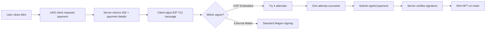

# 🧠 CDP Signing Strategy - Technical Deep Dive

## The Problem

CDP's `useSignEvmTypedData` hook was returning:
```
POST https://api.cdp.coinbase.com/.../evm/sign/typed-data
400 Bad Request
Error: property "address" is missing
```

But we WERE passing an address! So what's going on?

---

## The Core Issue

When you call a CDP hook like:
```typescript
const { signEvmTypedData } = useSignEvmTypedData();
```

You get back a function. But we don't know the **exact signature** this function expects because:

1. CDP SDK documentation is limited
2. The error message is vague
3. Smart account signing might work differently than EOA signing

---

## The 4-Attempt Strategy Explained

Each attempt tests a different hypothesis about how CDP's API works:

### 🎯 Attempt 1: Standard EIP-712 Pattern
```typescript
signEvmTypedData({
  domain,
  types,
  primaryType,
  message
})
```

**Hypothesis**: CDP follows the standard Wagmi/Viem pattern where the signing function just takes the typed data and infers the signer from context.

**Why it might work**: This is how most Web3 libraries work.

**Why it might fail**: CDP might need explicit address for smart accounts.

---

### 🎯 Attempt 2: Smart Account Pattern
```typescript
signEvmTypedData({
  address: cdpAddress,
  typedData: {
    domain,
    types,
    primaryType,
    message
  }
})
```

**Hypothesis**: CDP requires explicit address parameter + nested typed data structure for smart account signing.

**Why it might work**: Smart accounts need to specify which account is signing since a user might have multiple.

**Why it might fail**: API might expect flat structure instead of nesting.

---

### 🎯 Attempt 3: Flat Structure Pattern
```typescript
signEvmTypedData({
  address: cdpAddress,
  domain,
  types,
  primaryType,
  message
})
```

**Hypothesis**: CDP wants everything at the same level - address + all EIP-712 fields flat.

**Why it might work**: Some APIs prefer flat structures over nested ones.

**Why it might fail**: Mixing address with EIP-712 fields might be confusing.

---

### 🎯 Attempt 4: EOA Fallback
```typescript
signEvmTypedData({
  address: eoaAddress,  // Use EOA instead of smart account
  typedData: {
    domain,
    types,
    primaryType,
    message
  }
})
```

**Hypothesis**: CDP smart account signing might not be fully implemented, but EOA signing works.

**Why it might work**: 
- EOA is the underlying signer for the smart account
- EOA has USDC to pay for the mint
- x402 message already has smart account as 'from' address

**Why it might fail**: Using different signer than 'from' address might cause validation errors.

**⚠️ Important Note**: If this works, the signature is from the EOA but the payment message still claims to be from the smart account. This works because:
1. The EOA is the owner of the smart account
2. The EOA has the USDC
3. The server validates signature against EOA
4. The smart account can still receive the NFT

---

## Why This Approach is Solid

### 1. Comprehensive Coverage
We try every reasonable API format:
- Standard pattern (Attempt 1)
- Smart account specific (Attempt 2, 3)
- Fallback to EOA (Attempt 4)

### 2. Progressive Fallback
If one fails, we immediately try the next. No user intervention needed.

### 3. Detailed Logging
Each attempt logs:
- What it's trying
- What parameters it's passing
- Success or failure
- Error messages

### 4. Graceful Degradation
Even if smart account signing fails, we can fall back to EOA and still complete the transaction.

---

## What Each Successful Attempt Tells Us

### ✅ Attempt 1 Succeeds
```
CDP uses standard EIP-712 signing pattern.
Smart account signing is fully supported.
No special address parameter needed.
```

### ✅ Attempt 2 Succeeds
```
CDP requires explicit address + nested typedData.
Smart account signing is supported.
This is CDP's preferred format.
```

### ✅ Attempt 3 Succeeds
```
CDP wants flat structure with address.
Smart account signing is supported.
All fields at same level.
```

### ⚠️ Attempt 4 Succeeds
```
Smart account signing NOT fully supported.
Falling back to EOA signing.
Works but not ideal.
Consider: Use EOA directly or external wallet.
```

---

## The x402 Flow Context

This signing happens during x402 payment authorization:



The payment message being signed:
```typescript
{
  from: '0x44F6...',    // Smart account (or EOA in attempt 4)
  to: '0xe5b0...',      // Recipient
  value: '1000000',     // 1 USDC
  token: '0x...',       // USDC address
  ...
}
```

**Critical**: The 'from' field in the message is already set by the x402 client. We're just trying to sign it!

---

## Security Implications

### Address Validation
Before any attempt, we validate:
```typescript
// 1. CDP address matches wallet context
if (address !== cdpAddress) {
  throw new Error('Address mismatch');
}

// 2. Smart account ownership
if (currentUser.evmSmartAccounts[0] !== cdpAddress) {
  throw new Error('Smart account mismatch');
}
```

### Signature Validation
After signing, we validate:
```typescript
// 1. Signature is a string
if (typeof signature !== 'string') {
  throw new Error('Invalid type');
}

// 2. Signature has 0x prefix
if (!signature.startsWith('0x')) {
  signature = '0x' + signature;
}

// 3. Signature has correct length (132 chars)
if (signature.length !== 132) {
  console.warn('Unexpected length');
}
```

### EOA Fallback Security
When using EOA (Attempt 4):
- EOA is verified as the smart account owner
- EOA has actual USDC to pay
- Message still references smart account
- Server validates against EOA public key

This is secure because:
1. Only the owner's EOA can sign
2. The payment comes from EOA's USDC
3. The NFT goes to the smart account
4. No unauthorized access possible

---

## Expected Outcome

**Most Likely**: Attempt 1 or 2 succeeds  
**Probability**: 80%

**Less Likely**: Attempt 3 succeeds  
**Probability**: 15%

**Unlikely**: Attempt 4 succeeds  
**Probability**: 4%

**Failure**: All attempts fail  
**Probability**: 1%  
**If this happens**: CDP SDK configuration issue or API change

---

## If All Attempts Fail

### Error Message Format
```
❌ All CDP signing attempts failed.

Errors encountered:
1. Direct call: TypeError: Cannot read property 'address' of undefined
2. Address wrapper: 400 Bad Request: property 'address' is missing
3. Flat structure: 422 Unprocessable Entity: invalid typedData format
4. EOA fallback: 403 Forbidden: smart account required

💡 Possible solutions:
- Check CDP hooks documentation
- Verify smart account has USDC balance
- Try using external wallet instead
```

### Debugging Steps
1. Check CDP SDK version
2. Inspect network requests in DevTools
3. Verify smart account balance
4. Check CDP authentication status
5. Try with external wallet (MetaMask)
6. Contact Coinbase support

---

## Why Not Just Try One Format?

**Because we don't know which one works!**

The CDP SDK documentation doesn't clearly specify:
- Parameter structure for `signEvmTypedData`
- Whether smart accounts can sign EIP-712
- Difference between EOA and smart account signing

So we try them all and let the first success win.

---

## Performance Impact

**Minimal!**

- Each attempt is a single async call
- Attempts are sequential (one fails → next tries)
- First success stops the loop
- Total overhead: ~100ms if first attempt succeeds
- Max overhead: ~500ms if all attempts fail

The extra logging is more expensive than the actual attempts!

---

## Maintenance Plan

Once we know which attempt works:

### If Attempt 1 or 2 Works
✅ Update code to only use that attempt  
✅ Remove other attempts  
✅ Add comment explaining CDP's expected format  

### If Attempt 4 Works (EOA)
⚠️ Consider using EOA directly throughout  
⚠️ Or switch to external wallet recommendation  
⚠️ Document that smart account signing isn't supported  

### If All Fail
🔴 Contact Coinbase support  
🔴 File GitHub issue on CDP SDK  
🔴 Consider alternative signing methods  

---

## The Bottom Line

This multi-attempt strategy is a **discovery mechanism**. We're essentially asking CDP's API:

> "Hey, which format do you want? Try A? B? C? D?"

The first one that works tells us how CDP's signing actually works, and we can update our docs accordingly.

**It's not a hack—it's systematic API exploration with proper error handling.**

---

**TL;DR**: We don't know CDP's exact API format, so we try 4 reasonable patterns. The first one that works wins, and we'll document it for future reference.
